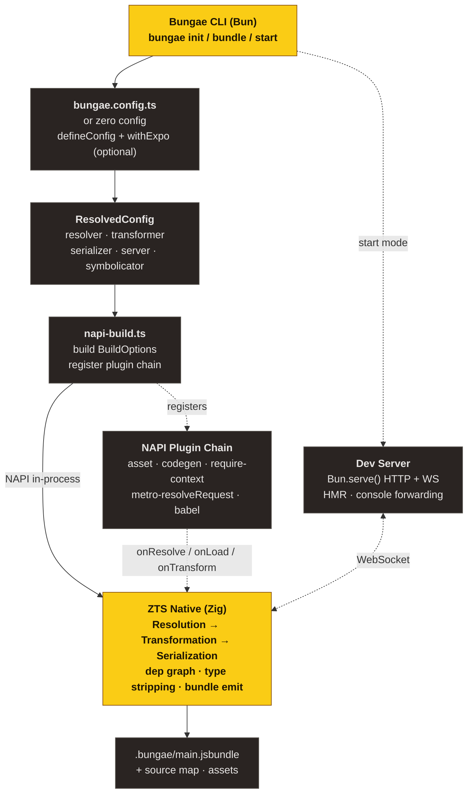
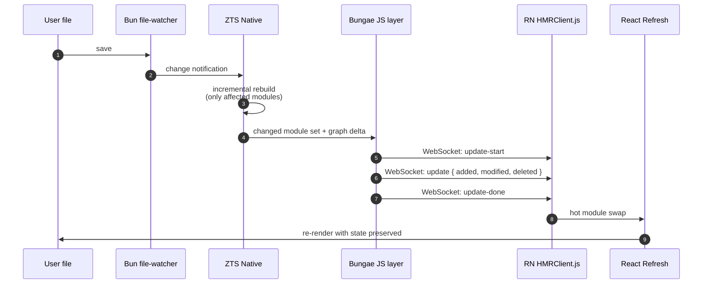
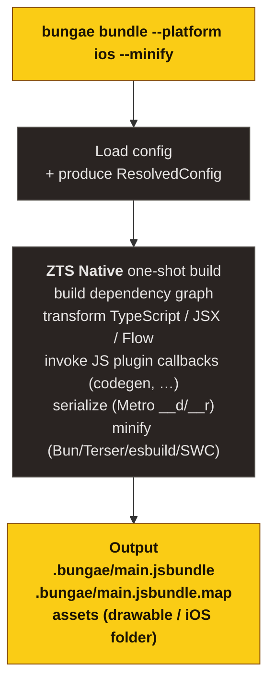

## At a Glance

## Layer Responsibilities

### 1. CLI (`packages/bungae/cli/`)

The `bungae <command> [options]` entry point. Parses arguments → loads config → dispatches to the chosen command.

| Command            | Responsibility                                              |
| ------------------ | ----------------------------------------------------------- |
| `init`             | Generates `bungae.config.ts` and patches scripts/.gitignore |
| `bundle` / `build` | One-shot production bundle                                  |
| `start` / `serve`  | Dev server with HMR                                         |
| `dependencies`     | (planned) Print module graph                                |

The zero-config auto-detection branch lives in the `detectExpo()` call block in `cli/main.ts`.

### 2. Config (`packages/bungae/src/config/`)

| File          | Role                                                                           |
| ------------- | ------------------------------------------------------------------------------ |
| `types.ts`    | Type definitions: `BungaeConfig`, `ResolvedConfig`, `ResolverConfig`, …        |
| `defaults.ts` | RN-friendly defaults (sourceExts, assetExts, getModulesRunBeforeMainModule, …) |
| `load.ts`     | Loads `bungae.config.{ts,js,json}` via dynamic import                          |
| `merge.ts`    | Deep merge (CLI > user config > defaults)                                      |
| `validate.ts` | Option validation                                                              |

`defineConfig(config)` is a type-narrowing helper with no runtime behavior.

### 3. ZTS Bundler Adapter (`packages/bungae/src/bundler/zts-bundler/`)

The Bungae-side layer that sits on top of `@zts/core` (the NAPI native module).

| File              | Role                                                                        |
| ----------------- | --------------------------------------------------------------------------- |
| `napi-build.ts`   | Converts `ResolvedConfig` → `BuildOptions` and registers the plugin chain   |
| `napi-plugins.ts` | NAPI plugin factories (asset, codegen, requireContext, metroResolve, babel) |
| `plugin-core.ts`  | Internal plugin logic (codegen view config transform, etc.)                 |
| `withExpo.ts`     | Expo integration wrapper plus the `detectExpo()` helper                     |
| `rn-constants.ts` | RN global identifiers, `tryResolve`, `resolveRnPolyfills`, etc.             |
| `server/`         | Dev server, HMR client, error overlay                                       |

### 4. ZTS Native (`zts/`)

A separate git submodule. Transpiler + bundler + NAPI binding, written in Zig.

| Module                   | Role                                                                          |
| ------------------------ | ----------------------------------------------------------------------------- |
| `packages/core/src/`     | The Zig core (lexer, parser, transformer, bundler, serializer)                |
| `packages/core/index.ts` | NAPI entry point (TypeScript) — exports `init/build/watch/buildPlugins`, etc. |
| `packages/core/zts.node` | Build artifact (the native module)                                            |

ZTS docs live at [ohah/zts](https://github.com/ohah/zts).

### 5. Dev Server

A unified HTTP + WebSocket server built on Bun.serve().

| Route                                       | Behavior                                                          |
| ------------------------------------------- | ----------------------------------------------------------------- |
| `GET /index.bundle?platform=ios`            | Per-platform bundle, served as multipart/mixed (Metro-compatible) |
| `GET /assets/*`                             | Static assets                                                     |
| `WS /`                                      | HMR message channel (Metro protocol)                              |
| `POST /symbolicate`                         | Stack-trace symbolication                                         |
| `GET /open-stack-frame`                     | Open files in the editor                                          |
| User routes wrapped via `enhanceMiddleware` | e.g. `/rozenite/*` (DevTools panels)                              |

ZTS runs alongside the Bungae JS layer in `--watch-json --dev` mode, and the JS layer wraps ZTS's transform output into the multipart response RN expects.

## Data Flow: Dev Session

## Data Flow: Production Bundle

## Next Steps

- [Bundling pipeline](/bungae/guides/pipeline/) — Resolution / Transformation / Serialization in depth
- [Plugin system](/bungae/guides/plugins/) — Authoring NAPI plugins
- [HMR & Fast Refresh](/bungae/guides/hmr/) — Metro HMR protocol compatibility
