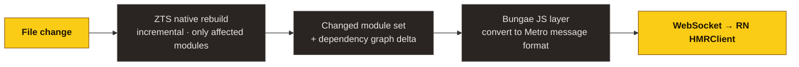

## TL;DR

> Uses the **Metro HMR protocol as-is**. RN's built-in `HMRClient.js` is unmodified. Fast Refresh preserves component state the same way.

## Why we picked the Metro protocol

A custom HMR protocol is possible, but:

| Aspect | Metro-compatible (Bungae's choice) | Custom protocol |
| --- | --- | --- |
| Initial implementation cost | Low | High |
| RN upgrades | Tracked automatically | Verify on every RN minor |
| Migration | None | User config changes required |
| Flipper / DevTools | Compatible | Separate handling |

→ The Metro protocol is already the de facto standard in the RN ecosystem. Following it wins on both compatibility and maintenance.

## Message format

Server → client:

```ts
{
  type: 'update-start',
  body: { isInitialUpdate: false },
}

{
  type: 'update',
  body: {
    revisionId: '...',
    isInitialUpdate: false,
    added: [
      { module: [moduleId, sourceCode], sourceURL, sourceMappingURL? },
    ],
    modified: [...],
    deleted: [/* moduleId[] */],
  },
}

{
  type: 'update-done',
}

{
  type: 'error',
  body: {
    type: 'TransformError' | 'BuildError',
    message: '...',
    errors: [...],
  },
}
```

`HMRClient.js` (built into RN) receives this and:

1. Walks the inverse-dependency graph upward to find React Refresh boundaries by module ID
2. Swaps only the affected components
3. Function components / hooks → state preserved
4. Class components / module-level changes → full page reload

## Fast Refresh

Enabled automatically. The `setUpReactRefresh` module is included in the dependency graph and behaves identically to Metro:

- Function component state preserved
- Hook state preserved
- Forces reload on changes outside `export default` (safe)
- On syntax error: error overlay only, state preserved

## Module ID consistency

For HMR to work, the same file must receive the same module ID across builds. Bungae:

- Uses ZTS's path-hash-based stable IDs
- Reuses the same `createModuleId` factory across graph build, increments, and HMR
- Same file path → same ID

## Multi-platform HMR

iOS and Android each get an independent HMR stream. Updates on one side don't affect the other. Since ZTS processes are per-platform, isolation is natural.

## How ZTS HMR works

ZTS runs in `--watch-json --dev` mode, and:



ZTS's incremental builds are typically in the millisecond range. Even on a 100k-file project, a single change costs tens of milliseconds.

## Do you need a custom HMR client?

Some projects, like [Rollipop](https://github.com/callstack/rollipop), use a custom HMR client and protocol (e.g. `hmr:update` / `hmr:reload`). Trade-offs:

| | Custom HMR | Metro-compatible |
| --- | --- | --- |
| Protocol freedom | High | Bound to RN standard |
| RN upgrade cost | Verify each time | Automatic |
| Extra features (e.g. chunked updates) | Implementable | Limited by RN standard |

Bungae prioritizes Metro compatibility, so it doesn't ship a custom client. We'll revisit if the Metro protocol's limits become clear.

## Debugging

To inspect HMR messages directly:

```bash
BUNGAE_HMR_PROFILE=1 bungae start --platform ios
```

→ Logs module count, time, and payload size on every update.
