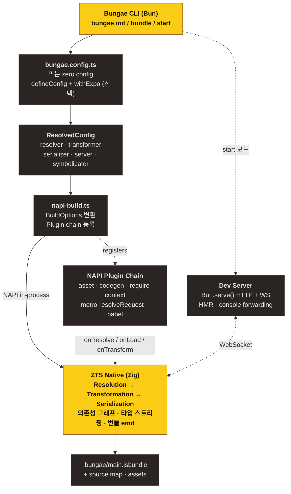
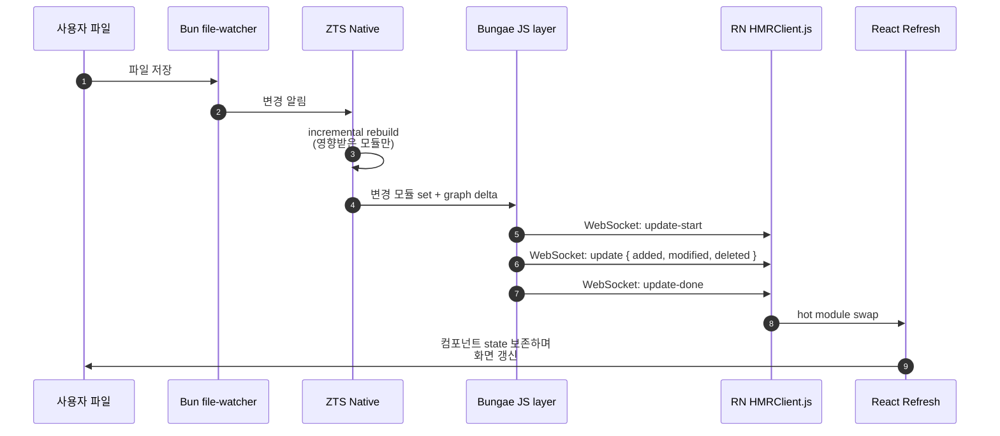
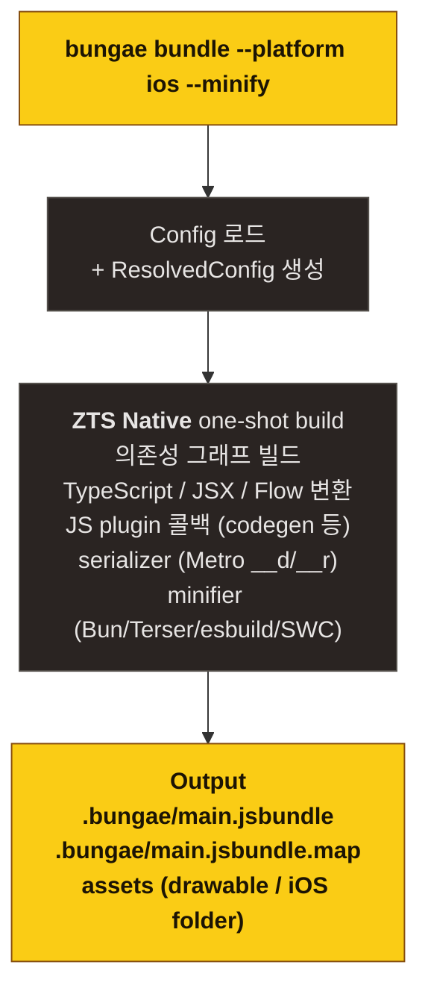

## 한 그림으로

## 레이어 별 책임

### 1. CLI (`packages/bungae/cli/`)

`bungae <command> [options]` 진입점. 인자 파싱 → config 로딩 → command 분기.

| 명령 | 책임 |
| --- | --- |
| `init` | `bungae.config.ts` 생성 + scripts/.gitignore 패치 |
| `bundle` / `build` | 프로덕션 번들 (one-shot) |
| `start` / `serve` | dev server + HMR |
| `dependencies` | (예정) 모듈 그래프 출력 |

Zero config 자동 감지 분기는 `cli/main.ts` 의 `detectExpo()` 호출 블록.

### 2. Config (`packages/bungae/src/config/`)

| 파일 | 역할 |
| --- | --- |
| `types.ts` | `BungaeConfig`, `ResolvedConfig`, `ResolverConfig`, … 타입 정의 |
| `defaults.ts` | RN-friendly 기본값 (sourceExts, assetExts, getModulesRunBeforeMainModule, …) |
| `load.ts` | `bungae.config.{ts,js,json}` 로드 + dynamic import |
| `merge.ts` | deep merge (CLI > 사용자 config > defaults) |
| `validate.ts` | 옵션 검증 |

`defineConfig(config)` 는 type-narrowing 헬퍼, 런타임 동작 없음.

### 3. ZTS Bundler 어댑터 (`packages/bungae/src/bundler/zts-bundler/`)

`@zts/core` (NAPI native module) 위에 얹는 Bungae 측 layer.

| 파일 | 역할 |
| --- | --- |
| `napi-build.ts` | `ResolvedConfig` → `BuildOptions` 변환 + plugin chain 등록 |
| `napi-plugins.ts` | NAPI plugin factory (asset, codegen, requireContext, metroResolve, babel) |
| `plugin-core.ts` | Plugin 내부 로직 (codegen view config transform 등) |
| `withExpo.ts` | Expo 통합 wrapper + `detectExpo()` 헬퍼 |
| `rn-constants.ts` | RN 글로벌 식별자, `tryResolve`, `resolveRnPolyfills` 등 |
| `server/` | dev server, HMR client, 에러 오버레이 |

### 4. ZTS Native (`zts/`)

별도 git submodule. Zig로 작성된 트랜스파일러 + 번들러 + NAPI binding.

| 모듈 | 역할 |
| --- | --- |
| `packages/core/src/` | Zig 본체 (lexer, parser, transformer, bundler, serializer) |
| `packages/core/index.ts` | NAPI 진입점 (TypeScript) — `init/build/watch/buildPlugins` 등 export |
| `packages/core/zts.node` | 빌드 결과물 (네이티브 모듈) |

ZTS 자체 문서: [ohah/zts](https://github.com/ohah/zts).

### 5. Dev Server

Bun.serve() 기반. HTTP + WebSocket 통합 server.

| 라우트 | 동작 |
| --- | --- |
| `GET /index.bundle?platform=ios` | platform별 bundle. multipart/mixed 응답 (Metro 호환) |
| `GET /assets/*` | 정적 에셋 |
| `WS /` | HMR 메시지 채널 (Metro 프로토콜) |
| `POST /symbolicate` | 스택 트레이스 심볼리케이션 |
| `GET /open-stack-frame` | 에디터에서 파일 열기 |
| `enhanceMiddleware`로 wrap된 사용자 라우트 | 예: `/rozenite/*` (DevTools panels) |

ZTS는 Bungae JS layer와 별개로 `--watch-json --dev` 모드로 떠 있고, JS layer는 ZTS의 변환 결과를 받아 multipart로 RN에 응답합니다.

## 데이터 흐름: dev session

## 데이터 흐름: production bundle

## 다음 단계

- [번들링 파이프라인](/bungae/guides/pipeline/) — Resolution / Transformation / Serialization 자세히
- [플러그인 시스템](/bungae/guides/plugins/) — NAPI plugin 작성법
- [HMR & Fast Refresh](/bungae/guides/hmr/) — Metro HMR 프로토콜 호환
