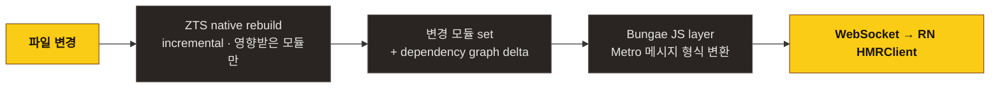

## 한 줄 요약

> **Metro HMR 프로토콜 그대로** 사용. RN 내장 `HMRClient.js` 수정 없음. Fast Refresh 컴포넌트 state 보존 동일.

## 왜 Metro 프로토콜을 채택했나

자체 HMR 프로토콜을 만들 수도 있지만:

| 항목               | Metro 호환 (Bungae 채택) | 자체 구현             |
| ------------------ | ------------------------ | --------------------- |
| 초기 구현 비용     | 낮음                     | 높음                  |
| RN 업그레이드      | 자동 추격                | 매 RN 마이너마다 검증 |
| 마이그레이션       | 0                        | 사용자 설정 변경 필요 |
| Flipper / DevTools | 호환                     | 별도 대응             |

→ Metro 프로토콜이 이미 RN 생태계의 사실상 표준. 따라가는 게 호환성 + 유지보수 모두 이득.

## 메시지 형식

서버 → 클라이언트:

```ts
{
  type: 'update-start',
  body: { isInitialUpdate: false },
}

{
  type: 'update',
  body: {
    revisionId: '...',
    isInitialUpdate: false,
    added: [
      { module: [moduleId, sourceCode], sourceURL, sourceMappingURL? },
    ],
    modified: [...],
    deleted: [/* moduleId[] */],
  },
}

{
  type: 'update-done',
}

{
  type: 'error',
  body: {
    type: 'TransformError' | 'BuildError',
    message: '...',
    errors: [...],
  },
}
```

`HMRClient.js` (RN 내장) 가 이걸 받아서:

1. Module ID로 React Refresh 경계 찾기 (역의존성 그래프 상향 순회)
2. 영향받은 컴포넌트만 swap
3. 함수 컴포넌트 / hook → state 보존
4. 클래스 컴포넌트 / module-level 변경 → 페이지 리로드

## Fast Refresh

자동으로 활성화됩니다. `setUpReactRefresh` 모듈이 의존성 그래프에 자동 포함되며 Metro와 동일하게 동작:

- ✅ 함수 컴포넌트 state 보존
- ✅ Hook state 보존
- ✅ 모듈 함수 (export default 외) 변경 시 강제 리로드 (안전)
- ✅ Syntax error 시 에러 오버레이만, state 유지

## 모듈 ID 일관성

빌드 사이에 같은 파일은 같은 모듈 ID를 받아야 HMR이 동작합니다. Bungae는:

- ZTS의 path hash 기반 stable ID
- 동일한 `createModuleId` factory를 graph 빌드 / increment / HMR 모두에서 재사용
- 파일 경로가 같으면 ID도 동일

## 다중 플랫폼 HMR

iOS / Android 각각 독립 HMR 스트림. 한쪽 update가 다른 쪽 영향 없음. ZTS 프로세스가 platform별이라 자연스럽게 분리됨.

## ZTS HMR 동작

ZTS는 `--watch-json --dev` 모드로 떠 있고:



ZTS의 incremental build는 일반적으로 ms 단위. 100k 파일 프로젝트에서도 변경 1개당 수십 ms.

## 직접 HMR 클라이언트가 필요한가?

[롤리팝](https://github.com/callstack/rollipop) 등 일부 프로젝트는 자체 HMR 클라이언트 + 프로토콜을 사용합니다 (`hmr:update` / `hmr:reload` 등). 장단점:

|                                 | 자체 HMR  | Metro 호환     |
| ------------------------------- | --------- | -------------- |
| 프로토콜 자유도                 | 높음      | RN 표준에 묶임 |
| RN 업그레이드 비용              | 매번 검증 | 자동           |
| 추가 기능 (예: chunked updates) | 구현 가능 | RN 표준에 의존 |

Bungae는 Metro 호환 우선이라 자체 클라이언트는 채택 안 함. Metro 프로토콜 한계가 명확해질 때 재검토.

## 디버깅

HMR 메시지를 직접 보고 싶다면:

```bash
BUNGAE_HMR_PROFILE=1 bungae start --platform ios
```

→ 매 update에 모듈 수 / 시간 / payload 사이즈 출력.
